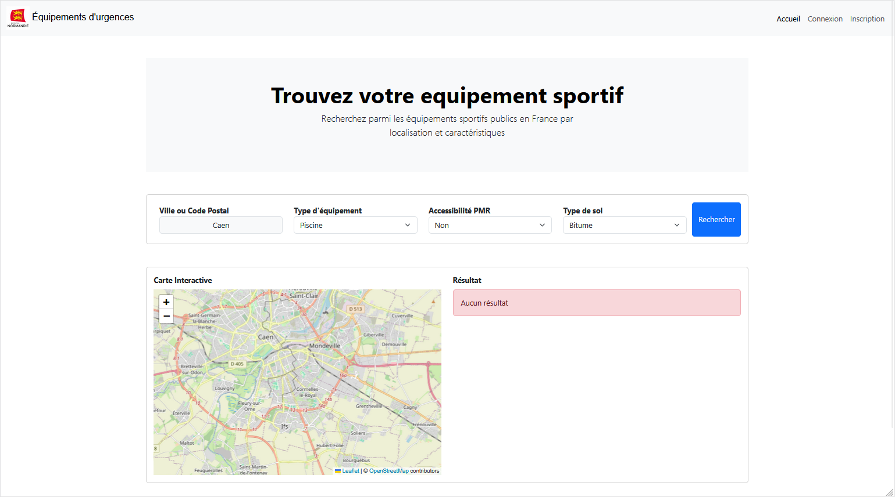

# GeoAbri

GeoAbri est une application web innovante permettant de localiser rapidement les refuges à proximité en cas de conditions climatiques extrêmes, telles que les tempêtes. Grâce à une interface simple et intuitive, l'utilisateur peut géolocaliser les points d'abri les plus proches de lui en quelques clics.

(<a href="#readme-top">retourner en haut</a>)

## Contributeurs

(<a href="#readme-top">retourner en haut</a>)

<!--
## Réalisé avec

* [![PHP][php-icon]][php-url]
* [![MySQL][mysql-icon]][mysql-url]
* [![Javascript][javascript-icon]][javascript-url]
* [![Bootstrap][bootstrap-icon]][bootstrap-url]
-->

<!-- MARKDOWN LINKS & IMAGES -->
[php-icon]:https://img.shields.io/badge/PHP-4f5b93?style=for-the-badge&logo=php&logoColor=FFFFFF
[php-url]:https://www.php.net/
[mysql-icon]:https://img.shields.io/badge/mysql-f29111?style=for-the-badge&logo=mysql&logoColor=00758f
[mysql-url]:https://www.mysql.com/
[javascript-icon]:https://img.shields.io/badge/Javascript-f6e239?style=for-the-badge&logo=javascript&logoColor=000000
[javascript-url]:https://developer.mozilla.org/fr/docs/Learn_web_development/Core/Scripting/What_is_JavaScript
[bootstrap-icon]:https://img.shields.io/badge/Bootstrap-563D7C?style=for-the-badge&logo=bootstrap&logoColor=white
[Bootstrap-url]:https://getbootstrap.com